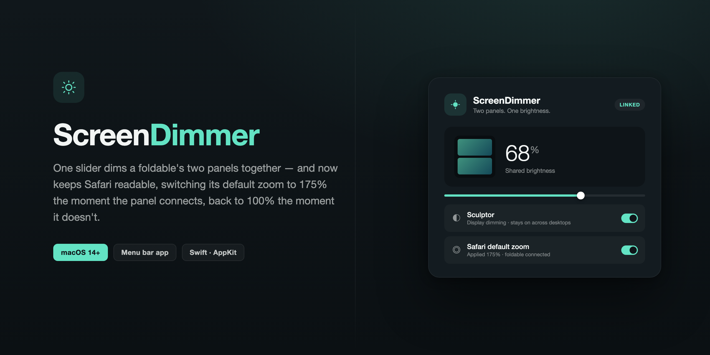

# ScreenDimmer



A native macOS menu bar app that dims all selected displays with one continuous slider. Built for a foldable Sculptor whose two physical panels appear as a single macOS display.

## Use

1. Set your previous brightness app to 100%, then quit it. Start with both physical panels at the same baseline brightness if your monitor allows it.
2. Open ScreenDimmer from Applications (or `build/ScreenDimmer.app` after building locally).
3. Leave Sculptor selected and move the slider. Both physical halves receive the same dimming amount across the entire range.
4. Use the sun icon in the menu bar to reopen the controls. Closing the window keeps the app running; Quit removes its dimming.

The built-in MacBook screen is excluded by default. External screens are selected by default, including newly connected ones. Display choices and brightness are remembered. Pause temporarily removes the dimming. Restore 100% removes it permanently until the slider is changed again. Control–Option–Command–0 restores 100% globally when the shortcut is available.

## Safari zoom sync

The foldable's logical point-size makes ordinary web pages render small. ScreenDimmer can automatically switch Safari's *default page zoom* between 175% (foldable connected) and 100% (foldable disconnected), so pages look right without you touching Safari's own settings each time you plug or unplug.

- Toggle it on/off from the "Safari default zoom" panel in ScreenDimmer's window.
- It writes Safari's `DefaultPageZoom` preference directly and only fires on a connect/disconnect transition, matching the same built-in-vs-external display detection already used for dimming.
- The change affects **new** Safari windows/tabs going forward. Already-open windows keep their current zoom until you relaunch Safari — this is intentional so an in-progress session (unsaved form text, active downloads) is never force-closed.
- Because Safari is a sandboxed app, writing its preference requires **Full Disk Access** for ScreenDimmer (System Settings → Privacy & Security → Full Disk Access). Without it, the panel shows a clear inline error instead of silently doing nothing; dimming and every other feature work normally either way.

## Why this approach

On this Mac, macOS reported a built-in Color LCD plus one Sculptor at 3200 × 2560, rotated 90°. This establishes that the two physical halves are one logical external display. It does not establish the monitor firmware's exact brightness behavior.

The reported first-half/second-half slider behavior is consistent with a hardware control quirk or an app switching between hardware and software control. [MonitorControl documents its combined hardware/software dimming](https://github.com/MonitorControl/MonitorControl#readme). ScreenDimmer avoids that crossover: version 1.1 scales each selected display's RGB transfer tables by the shared brightness factor for the entire slider range. This applies to display output rather than a desktop window, so dimming does not depend on an overlay appearing after a macOS Spaces transition. The original per-channel tables are retained; repeated adjustments always use that baseline, avoiding cumulative dimming. There is no special behavior at 50% and no hardware DDC control.

Version 1.0 used a black overlay window and could briefly expose full brightness during three-finger desktop swipes. The overlay is now used only if the display cannot apply and read back gamma-table dimming. That fallback is labeled in the interface and may still flash during desktop transitions. Pause, Restore, deselecting a display, and normal Quit restore the captured gamma tables.

This is software dimming: it darkens the image, not the physical backlight, and does not reduce backlight power. Percentages represent the software setting, not measured luminance. It cannot brighten beyond the monitor's current baseline or fix an existing physical mismatch between panels. Gamma dimming may not appear in screenshots or screen sharing; the overlay fallback may appear. Other apps that change gamma, Night Shift, True Tone, or color-profile changes can affect the result. Avoid running multiple dimming apps together. Protected video, HDR and every full-screen/Spaces configuration need testing on the actual content you use.

## Build and verify

Requires Apple Silicon, macOS 14+, and Xcode Command Line Tools. No third-party packages, network service, administrator access, Accessibility permission, or Screen Recording permission are required by the app.

```sh
bash scripts/build.sh
bash scripts/test.sh
build/ScreenDimmer.app/Contents/MacOS/ScreenDimmer --diagnostics
build/ScreenDimmer.app/Contents/MacOS/ScreenDimmer --integration-test
open build/ScreenDimmer.app
```

To install a local build, copy `build/ScreenDimmer.app` into Applications. To use a packaged release, unzip `ScreenDimmer-macOS-arm64.zip`, then copy `ScreenDimmer.app` into Applications. The app is built for Apple Silicon Macs running macOS 14 or later. It is locally signed, not Apple-notarized; macOS may require manual approval for a copy downloaded on another Mac.

Diagnostics need access to the logged-in macOS graphical session. Integration tests briefly exercise display-level dimming at several brightness levels, verify RGB readback and original-table restoration, and check fallback overlay bounds and click-through. They use isolated preferences. Do not run the integration test while another ScreenDimmer instance is dimming, because their dimming would compound and captured baselines would be wrong.

Display frames come from `NSScreen.frame`, so negative origins, rotation and scaled displays use their current macOS geometry. Windows rebuild on display changes and refresh after wake/Space changes. The 15% minimum prevents full blackout. Normal Quit and SIGTERM restore only the gamma tables this app captured, leaving hardware brightness unchanged. Forced termination and crashes have not been verified; use normal Quit when possible.

Uses Apple's [display gamma API](https://developer.apple.com/documentation/coregraphics/cgsetdisplaytransferbytable(_:_:_:_:_:)), [NSWindow API](https://developer.apple.com/documentation/appkit/nswindow) and [overlay collection behavior](https://developer.apple.com/documentation/appkit/nswindow/collectionbehavior-swift.struct/canjoinallapplications). The build is locally ad-hoc signed; it is not notarized for distribution to other Macs.
